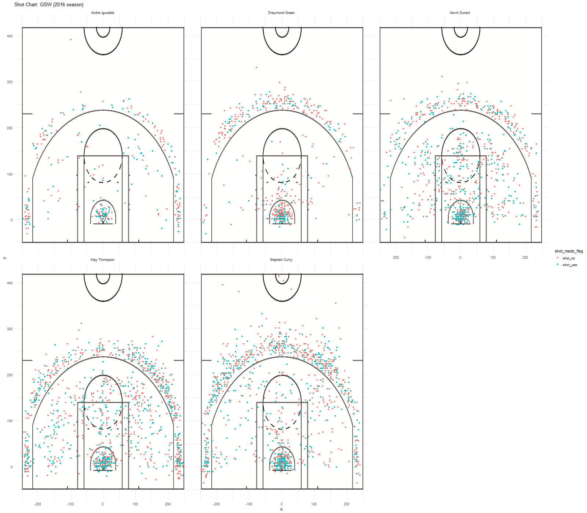

Workout01
================
Daiqiao Lin

Introduction:five top players of gsw and nba
============================================

> To be honest, I am a fan of Golden Warriors, a fan of Stephen Curry, I became a fan of him and the team long before their first champion took place. It was such a great journey to see my favorite team to grow from somewhat a nameless team somewhere in the west side to be the top team in the NBA league.

 The five players I mentioned above are Klay Thompson, Kevin Durant Stephen Curry, Draymond Green and Andre Iguodala. Here I will provide a detailed description of the 2016 season's from the shot-data.

1.  Efficiency

-   First, we would have a general view of five player.

We would see that Stephen Curry, Kevin Durant and Klay Thomson are always shooting a great number of points. As there should not be breaking news that the Warriors can shoot.

eff shooting by %
-----------------

``` r
library(dplyr)
```

    ## 
    ## Attaching package: 'dplyr'

    ## The following objects are masked from 'package:stats':
    ## 
    ##     filter, lag

    ## The following objects are masked from 'package:base':
    ## 
    ##     intersect, setdiff, setequal, union

``` r
ap<-read.csv('C://Users//26073//Desktop//berkeley//classes//stat133//workout01//data//shots-data.csv',stringsAsFactors = FALSE)

currys<-ap[ap$player=='Stephen Curry',c('player','shot_made_flag','shot_type')]
csumtotal=sum(table(currys$shot_made_flag))
csumyestotal=sum(table(currys$shot_made_flag[currys$shot_made_flag=='shot_yes']))
ctwototal=currys[currys$shot_type=='2PT Field Goal',]
cthreetotal=currys[currys$shot_type=='3PT Field Goal',]
csum2total=sum(table(ctwototal$shot_type))
csum2yestotal=sum(table(ctwototal$shot_type[ctwototal$shot_made_flag=='shot_yes']))
csum3total=sum(table(cthreetotal$shot_type))
csum3yestotal=sum(table(cthreetotal$shot_type[cthreetotal$shot_made_flag=='shot_yes']))

kevins<-ap[ap$player=='Kevin Durant',c('player','shot_made_flag','shot_type')]
ksumtotal=sum(table(kevins$shot_made_flag))
ksumyestotal=sum(table(kevins$shot_made_flag[kevins$shot_made_flag=='shot_yes']))
ktwototal=kevins[kevins$shot_type=='2PT Field Goal',]
kthreetotal=kevins[kevins$shot_type=='3PT Field Goal',]
ksum2total=sum(table(ktwototal$shot_type))
ksum2yestotal=sum(table(ktwototal$shot_type[ktwototal$shot_made_flag=='shot_yes']))
ksum3total=sum(table(kthreetotal$shot_type))
ksum3yestotal=sum(table(kthreetotal$shot_type[kthreetotal$shot_made_flag=='shot_yes']))

thompson<-ap[ap$player=='Kevin Durant',c('player','shot_made_flag','shot_type')]
tsumtotal=sum(table(thompson$shot_made_flag))
tsumyestotal=sum(table(thompson$shot_made_flag[thompson$shot_made_flag=='shot_yes']))
ttwototal=thompson[thompson$shot_type=='2PT Field Goal',]
tthreetotal=thompson[thompson$shot_type=='3PT Field Goal',]
tsum2total=sum(table(ttwototal$shot_type))
tsum2yestotal=sum(table(ttwototal$shot_type[ttwototal$shot_made_flag=='shot_yes']))
tsum3total=sum(table(tthreetotal$shot_type))
tsum3yestotal=sum(table(tthreetotal$shot_type[tthreetotal$shot_made_flag=='shot_yes']))

greens<-ap[ap$player=='Draymond Green',c('player','shot_made_flag','shot_type')]
gsumtotal=sum(table(greens$shot_made_flag))
gsumyestotal=sum(table(greens$shot_made_flag[greens$shot_made_flag=='shot_yes']))
gtwototal=greens[greens$shot_type=='2PT Field Goal',]
gthreetotal=greens[greens$shot_type=='3PT Field Goal',]
gsum2total=sum(table(gtwototal$shot_type))
gsum2yestotal=sum(table(gtwototal$shot_type[gtwototal$shot_made_flag=='shot_yes']))
gsum3total=sum(table(gthreetotal$shot_type))
gsum3yestotal=sum(table(gthreetotal$shot_type[gthreetotal$shot_made_flag=='shot_yes']))


iguodalas<-ap[ap$player=='Andre Iguodala',c('player','shot_made_flag','shot_type')]
isumtotal=sum(table(iguodalas$shot_made_flag))
isumyestotal=sum(table(iguodalas$shot_made_flag[iguodalas$shot_made_flag=='shot_yes']))
itwototal=iguodalas[iguodalas$shot_type=='2PT Field Goal',]
ithreetotal=iguodalas[iguodalas$shot_type=='3PT Field Goal',]
isum2total=sum(table(itwototal$shot_type))
isum2yestotal=sum(table(itwototal$shot_type[itwototal$shot_made_flag=='shot_yes']))
isum3total=sum(table(ithreetotal$shot_type))
isum3yestotal=sum(table(ithreetotal$shot_type[ithreetotal$shot_made_flag=='shot_yes']))


player_name=c('Stephen curry','Kevin Durant','Draymond Green','Klay Thompson','Andre Iguodala')
sumtotal=c(csumtotal,ksumtotal,gsumtotal,tsumtotal,isumtotal)
summade=c(csumyestotal,ksumyestotal,gsumyestotal,tsumyestotal,isumyestotal)
sum2total=c(csum2total,ksum2total,gsum2total,tsum2total,isum2total)
sum2made=c(csum2yestotal,ksum2yestotal,gsum2yestotal,tsum2yestotal,isum2yestotal)
sum3total=c(csum3total,ksum3total,gsum3total,tsum3total,isum3total)
sum3made=c(csum3yestotal,ksum3yestotal,gsum3yestotal,tsum3yestotal,isum3yestotal)

value_arrange=data.frame(name=player_name,total=sumtotal,made=summade)
arrange(mutate(value_arrange,perc_made=made/total),desc(perc_made))
```

    ##             name total made perc_made
    ## 1   Kevin Durant   915  495 0.5409836
    ## 2  Klay Thompson   915  495 0.5409836
    ## 3 Andre Iguodala   371  192 0.5175202
    ## 4  Stephen curry  1250  584 0.4672000
    ## 5 Draymond Green   578  245 0.4238754

-   We can also have a look at the below table to have a general view of the 2 points eff shooting effectiveness by percentage

2point eff shooting by %
------------------------

``` r
library(dplyr)
ap<-read.csv('C://Users//26073//Desktop//berkeley//classes//stat133//workout01//data//shots-data.csv',stringsAsFactors = FALSE)

currys<-ap[ap$player=='Stephen Curry',c('player','shot_made_flag','shot_type')]
csumtotal=sum(table(currys$shot_made_flag))
csumyestotal=sum(table(currys$shot_made_flag[currys$shot_made_flag=='shot_yes']))
ctwototal=currys[currys$shot_type=='2PT Field Goal',]
cthreetotal=currys[currys$shot_type=='3PT Field Goal',]
csum2total=sum(table(ctwototal$shot_type))
csum2yestotal=sum(table(ctwototal$shot_type[ctwototal$shot_made_flag=='shot_yes']))
csum3total=sum(table(cthreetotal$shot_type))
csum3yestotal=sum(table(cthreetotal$shot_type[cthreetotal$shot_made_flag=='shot_yes']))

kevins<-ap[ap$player=='Kevin Durant',c('player','shot_made_flag','shot_type')]
ksumtotal=sum(table(kevins$shot_made_flag))
ksumyestotal=sum(table(kevins$shot_made_flag[kevins$shot_made_flag=='shot_yes']))
ktwototal=kevins[kevins$shot_type=='2PT Field Goal',]
kthreetotal=kevins[kevins$shot_type=='3PT Field Goal',]
ksum2total=sum(table(ktwototal$shot_type))
ksum2yestotal=sum(table(ktwototal$shot_type[ktwototal$shot_made_flag=='shot_yes']))
ksum3total=sum(table(kthreetotal$shot_type))
ksum3yestotal=sum(table(kthreetotal$shot_type[kthreetotal$shot_made_flag=='shot_yes']))

thompson<-ap[ap$player=='Kevin Durant',c('player','shot_made_flag','shot_type')]
tsumtotal=sum(table(thompson$shot_made_flag))
tsumyestotal=sum(table(thompson$shot_made_flag[thompson$shot_made_flag=='shot_yes']))
ttwototal=thompson[thompson$shot_type=='2PT Field Goal',]
tthreetotal=thompson[thompson$shot_type=='3PT Field Goal',]
tsum2total=sum(table(ttwototal$shot_type))
tsum2yestotal=sum(table(ttwototal$shot_type[ttwototal$shot_made_flag=='shot_yes']))
tsum3total=sum(table(tthreetotal$shot_type))
tsum3yestotal=sum(table(tthreetotal$shot_type[tthreetotal$shot_made_flag=='shot_yes']))

greens<-ap[ap$player=='Draymond Green',c('player','shot_made_flag','shot_type')]
gsumtotal=sum(table(greens$shot_made_flag))
gsumyestotal=sum(table(greens$shot_made_flag[greens$shot_made_flag=='shot_yes']))
gtwototal=greens[greens$shot_type=='2PT Field Goal',]
gthreetotal=greens[greens$shot_type=='3PT Field Goal',]
gsum2total=sum(table(gtwototal$shot_type))
gsum2yestotal=sum(table(gtwototal$shot_type[gtwototal$shot_made_flag=='shot_yes']))
gsum3total=sum(table(gthreetotal$shot_type))
gsum3yestotal=sum(table(gthreetotal$shot_type[gthreetotal$shot_made_flag=='shot_yes']))


iguodalas<-ap[ap$player=='Andre Iguodala',c('player','shot_made_flag','shot_type')]
isumtotal=sum(table(iguodalas$shot_made_flag))
isumyestotal=sum(table(iguodalas$shot_made_flag[iguodalas$shot_made_flag=='shot_yes']))
itwototal=iguodalas[iguodalas$shot_type=='2PT Field Goal',]
ithreetotal=iguodalas[iguodalas$shot_type=='3PT Field Goal',]
isum2total=sum(table(itwototal$shot_type))
isum2yestotal=sum(table(itwototal$shot_type[itwototal$shot_made_flag=='shot_yes']))
isum3total=sum(table(ithreetotal$shot_type))
isum3yestotal=sum(table(ithreetotal$shot_type[ithreetotal$shot_made_flag=='shot_yes']))


player_name=c('Stephen curry','Kevin Durant','Draymond Green','Klay Thompson','Andre Iguodala')
sumtotal=c(csumtotal,ksumtotal,gsumtotal,tsumtotal,isumtotal)
summade=c(csumyestotal,ksumyestotal,gsumyestotal,tsumyestotal,isumyestotal)
sum2total=c(csum2total,ksum2total,gsum2total,tsum2total,isum2total)
sum2made=c(csum2yestotal,ksum2yestotal,gsum2yestotal,tsum2yestotal,isum2yestotal)
sum3total=c(csum3total,ksum3total,gsum3total,tsum3total,isum3total)
sum3made=c(csum3yestotal,ksum3yestotal,gsum3yestotal,tsum3yestotal,isum3yestotal)

value_2parrange=data.frame(name=player_name,total=sum2total,made=sum2made)
arrange(mutate(value_arrange,perc_made2=made/total),desc(perc_made2))
```

    ##             name total made perc_made2
    ## 1   Kevin Durant   915  495  0.5409836
    ## 2  Klay Thompson   915  495  0.5409836
    ## 3 Andre Iguodala   371  192  0.5175202
    ## 4  Stephen curry  1250  584  0.4672000
    ## 5 Draymond Green   578  245  0.4238754

-   Third, the 3points vision.

3point eff shooting by %
------------------------

``` r
library(dplyr)
ap<-read.csv('C://Users//26073//Desktop//berkeley//classes//stat133//workout01//data//shots-data.csv',stringsAsFactors = FALSE)

currys<-ap[ap$player=='Stephen Curry',c('player','shot_made_flag','shot_type')]
csumtotal=sum(table(currys$shot_made_flag))
csumyestotal=sum(table(currys$shot_made_flag[currys$shot_made_flag=='shot_yes']))
ctwototal=currys[currys$shot_type=='2PT Field Goal',]
cthreetotal=currys[currys$shot_type=='3PT Field Goal',]
csum2total=sum(table(ctwototal$shot_type))
csum2yestotal=sum(table(ctwototal$shot_type[ctwototal$shot_made_flag=='shot_yes']))
csum3total=sum(table(cthreetotal$shot_type))
csum3yestotal=sum(table(cthreetotal$shot_type[cthreetotal$shot_made_flag=='shot_yes']))

kevins<-ap[ap$player=='Kevin Durant',c('player','shot_made_flag','shot_type')]
ksumtotal=sum(table(kevins$shot_made_flag))
ksumyestotal=sum(table(kevins$shot_made_flag[kevins$shot_made_flag=='shot_yes']))
ktwototal=kevins[kevins$shot_type=='2PT Field Goal',]
kthreetotal=kevins[kevins$shot_type=='3PT Field Goal',]
ksum2total=sum(table(ktwototal$shot_type))
ksum2yestotal=sum(table(ktwototal$shot_type[ktwototal$shot_made_flag=='shot_yes']))
ksum3total=sum(table(kthreetotal$shot_type))
ksum3yestotal=sum(table(kthreetotal$shot_type[kthreetotal$shot_made_flag=='shot_yes']))

thompson<-ap[ap$player=='Kevin Durant',c('player','shot_made_flag','shot_type')]
tsumtotal=sum(table(thompson$shot_made_flag))
tsumyestotal=sum(table(thompson$shot_made_flag[thompson$shot_made_flag=='shot_yes']))
ttwototal=thompson[thompson$shot_type=='2PT Field Goal',]
tthreetotal=thompson[thompson$shot_type=='3PT Field Goal',]
tsum2total=sum(table(ttwototal$shot_type))
tsum2yestotal=sum(table(ttwototal$shot_type[ttwototal$shot_made_flag=='shot_yes']))
tsum3total=sum(table(tthreetotal$shot_type))
tsum3yestotal=sum(table(tthreetotal$shot_type[tthreetotal$shot_made_flag=='shot_yes']))

greens<-ap[ap$player=='Draymond Green',c('player','shot_made_flag','shot_type')]
gsumtotal=sum(table(greens$shot_made_flag))
gsumyestotal=sum(table(greens$shot_made_flag[greens$shot_made_flag=='shot_yes']))
gtwototal=greens[greens$shot_type=='2PT Field Goal',]
gthreetotal=greens[greens$shot_type=='3PT Field Goal',]
gsum2total=sum(table(gtwototal$shot_type))
gsum2yestotal=sum(table(gtwototal$shot_type[gtwototal$shot_made_flag=='shot_yes']))
gsum3total=sum(table(gthreetotal$shot_type))
gsum3yestotal=sum(table(gthreetotal$shot_type[gthreetotal$shot_made_flag=='shot_yes']))


iguodalas<-ap[ap$player=='Andre Iguodala',c('player','shot_made_flag','shot_type')]
isumtotal=sum(table(iguodalas$shot_made_flag))
isumyestotal=sum(table(iguodalas$shot_made_flag[iguodalas$shot_made_flag=='shot_yes']))
itwototal=iguodalas[iguodalas$shot_type=='2PT Field Goal',]
ithreetotal=iguodalas[iguodalas$shot_type=='3PT Field Goal',]
isum2total=sum(table(itwototal$shot_type))
isum2yestotal=sum(table(itwototal$shot_type[itwototal$shot_made_flag=='shot_yes']))
isum3total=sum(table(ithreetotal$shot_type))
isum3yestotal=sum(table(ithreetotal$shot_type[ithreetotal$shot_made_flag=='shot_yes']))


player_name=c('Stephen curry','Kevin Durant','Draymond Green','Klay Thompson','Andre Iguodala')
sumtotal=c(csumtotal,ksumtotal,gsumtotal,tsumtotal,isumtotal)
summade=c(csumyestotal,ksumyestotal,gsumyestotal,tsumyestotal,isumyestotal)
sum2total=c(csum2total,ksum2total,gsum2total,tsum2total,isum2total)
sum2made=c(csum2yestotal,ksum2yestotal,gsum2yestotal,tsum2yestotal,isum2yestotal)
sum3total=c(csum3total,ksum3total,gsum3total,tsum3total,isum3total)
sum3made=c(csum3yestotal,ksum3yestotal,gsum3yestotal,tsum3yestotal,isum3yestotal)

value_3parrange=data.frame(name=player_name,total=sum3total,made=sum3made)
arrange(mutate(value_arrange,perc_made3=made/total),desc(perc_made3))
```

    ##             name total made perc_made3
    ## 1   Kevin Durant   915  495  0.5409836
    ## 2  Klay Thompson   915  495  0.5409836
    ## 3 Andre Iguodala   371  192  0.5175202
    ## 4  Stephen curry  1250  584  0.4672000
    ## 5 Draymond Green   578  245  0.4238754

Then we can also use the shot-chart to have a general view of the shooting space of the above five players. 

From the above graph, we could see that Durant, Klay and Curry shot the most and in a similar pattern: that is, the most points and gained near the basket or as three points. We have to admitted that such shooting pattern change the NBA history. in previous teams, players tend not to gain most of their points far from the basket. But Curry change the game rule and people have now changed their mind. With Durant get in GSW, the team is now becoming more and more unstoppable.

> We could also seen from the above thatGolden Warrior is a team hurrying to win the game by team work, not much to do with the only person.
